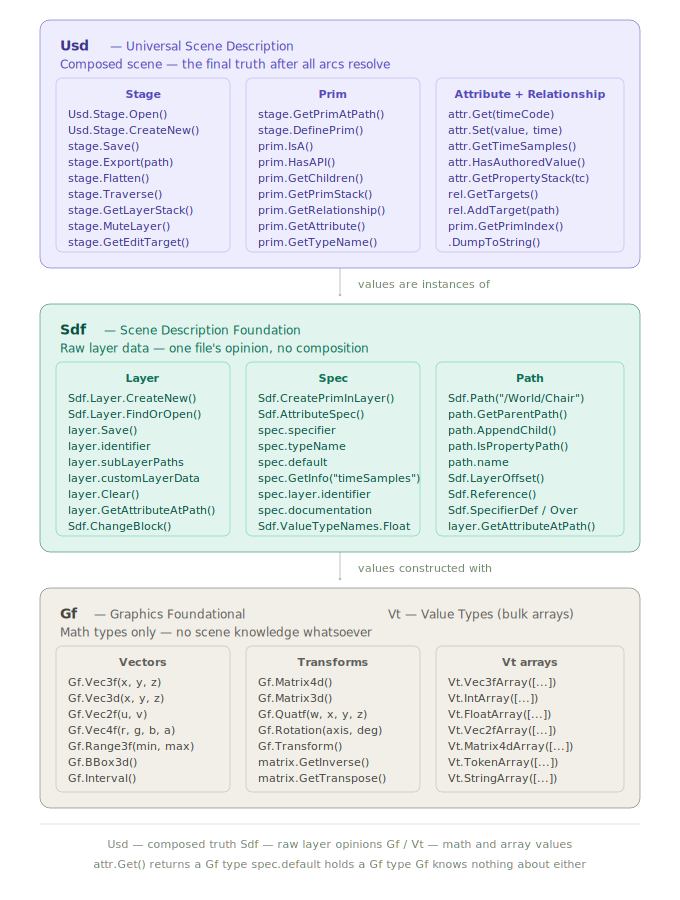

# Day 1 — USD Foundations

> **OpenUSD NCP Certification Study Notes**  
> _Universal Scene Description — Core Architecture_

---

## Table of Contents

0. [The Three Core Libraries](#0-the-three-core-libraries)
1. [The Stage](#1-the-stage)
2. [Layers](#2-layers)
3. [Prims — The Scene Graph](#3-prims--the-scene-graph)
4. [Properties — Attributes and Relationships](#4-properties--attributes-and-relationships)
5. [SdfPath — Addressing the Scene](#5-sdfpath--addressing-the-scene)
6. [USD File Formats](#6-usd-file-formats)
7. [Metadata](#7-metadata)
8. [Time Samples and Animation](#8-time-samples-and-animation)
9. [The Three Core Libraries — Gf, Sdf, and Usd](#9-the-three-core-libraries--gf-sdf-and-usd)
10. [Key Takeaways](#9-key-takeaways)

---

## 0. The Three Core Libraries

Every USD Python script begins with `from pxr import ...`. Understanding which library does what prevents confusion when reading API documentation.

| Library    | Full Name                        | Job                                                                                         | Knows about                                   |
| ---------- | -------------------------------- | ------------------------------------------------------------------------------------------- | --------------------------------------------- |
| `Usd`      | **Universal Scene Description**  | Composed scene — opens stages, traverses prims, reads winning values after all arcs resolve | Everything — composition, arcs, layers, types |
| `Sdf`      | **Scene Description Foundation** | Raw layer data — one file's opinions, no composition                                        | One layer at a time. No arc resolution.       |
| `Gf`       | **Graphics Foundational**        | Math types only — vectors, matrices, quaternions                                            | Nothing about USD scenes                      |
| `Vt`       | **Value Types**                  | Array containers for bulk geometry data                                                     | Works alongside Gf                            |
| `UsdGeom`  | **USD Geometry schemas**         | Typed schemas for meshes, cameras, xforms, lights                                           | Builds on top of Usd                          |
| `UsdShade` | **USD Shading schemas**          | Materials, shaders, shader networks                                                         | Builds on top of Usd                          |
| `UsdLux`   | **USD Lighting schemas**         | Light source schemas                                                                        | Builds on top of Usd                          |
| `UsdUtils` | **USD Utilities**                | Helper functions — flattening, layer copying, validation                                    | Builds on top of Usd and Sdf                  |

---

## 1. The Stage

The **Stage** (`Usd.Stage`) is the top-level in-memory container that represents your entire 3D scene. It is what renderers, viewports, and tools operate on. Everything — geometry, lights, cameras, materials — is accessed through the stage.

> **Critical concept:** A Stage is _not_ a file. It is a live, in-memory composition assembled from one or more **Layers**. When you open a USD file, USD reads it, resolves all references, and assembles a composed Stage in memory.

```
                ┌─────────────┐  ┌─────────────┐  ┌─────────────┐
                │ lighting.   │  │ layout.     │  │ models.     │
                │ usda        │  │ usda        │  │ usda        │
                └──────┬──────┘  └──────┬──────┘  └──────┬──────┘
                       │                │                  │
                       └────────────────┴──────────────────┘
                                        │
                                        ▼
                             ┌──────────────────────┐
                             │   COMPOSED STAGE     │
                             │  (in-memory view)    │
                             └──────────────────────┘
```

### Python API — `Usd.Stage`

```python
from pxr import Usd

# Create a new stage backed by a real file on disk
# The file is created immediately even before any content is added
stage = Usd.Stage.CreateNew("my_scene.usda")

# Open an existing USD file
# USD loads the file and all files it transitively references
stage = Usd.Stage.Open("my_scene.usda")

# Create an in-memory stage with no file backing
# Use for testing, temporary work, or before deciding on output path
stage = Usd.Stage.CreateInMemory()

# Save all changes back to the backing file(s)
stage.Save()

# Export the stage to a new path (optionally converting format)
# stage.Export() flattens ALL composition into a single layer
stage.Export("output.usdc")

# Inspect the stage as USDA text — invaluable for debugging
print(stage.ExportToString(addSourceFileComment=False))
```

| Method             | Behaviour                                                |
| ------------------ | -------------------------------------------------------- |
| `CreateNew(path)`  | Creates file on disk immediately, returns writable stage |
| `Open(path)`       | Opens existing file, assembles all referenced layers     |
| `CreateInMemory()` | No disk file, all in RAM                                 |
| `Save()`           | Writes dirty layers back to their backing files          |
| `Export(path)`     | Flattens and writes to a new file at `path`              |

---

## 2. Layers

A **Layer** (`Sdf.Layer`) is a single USD file — or in-memory buffer — containing scene description. It is the physical unit of storage. Stages are assembled from layers; layers are what actually exist on disk.

### Layer Stack

Every stage has a **root layer** and zero or more **sublayers**. Sublayers are declared inside the root layer's metadata and are loaded in order. The order matters — earlier sublayers have **higher strength** (their opinions win when there is a conflict).

```usda
#usda 1.0
(
    subLayers = [
        @./anim.usda@,       # strongest — loaded first
        @./layout.usda@,
        @./model.usda@       # weakest — loaded last
    ]
)
```

### Python API — `Sdf.Layer`

```python
from pxr import Sdf, Usd

# Find a layer that is already loaded (by its identifier/path)
layer = Sdf.Layer.FindOrOpen("model.usda")

# Access the root layer of a stage
root_layer = stage.GetRootLayer()

# Access the session layer (in-memory, ephemeral, always strongest)
session_layer = stage.GetSessionLayer()

# Inspect all layers in the root layer stack, strongest → weakest
for layer in stage.GetLayerStack():
    print(layer.identifier)

# Add a sublayer programmatically
root_layer.subLayerPaths.append("./new_layer.usda")

# Read and write layer-level metadata
root_layer.customLayerData = {
    "pipeline:schemaVersion": "2.0",
    "pipeline:studio":        "AcmeStudios",
}
```

> **The session layer** is a special in-memory layer that is always the strongest. It captures interactive edits (e.g., from usdview). It is **never saved to disk** by `stage.Save()`. Use it for temporary per-session overrides.

---

## 3. Prims — The Scene Graph

A **Prim** (Primitive) is every individual node in the scene graph. Every mesh, light, camera, material, or empty organising container is a prim. The scene graph is a tree of prims.

```
/                             ← pseudo-root (always exists, invisible)
└── World  (Xform)            ← organising container
    ├── Geometry  (Scope)     ← namespace grouping (no transform)
    │   ├── Chair  (Mesh)     ← polygon geometry
    │   └── Table  (Mesh)
    ├── Lights  (Scope)
    │   └── KeyLight  (DistantLight)
    └── Materials  (Scope)
        └── WoodMat  (Material)
```

### Prim Specifiers

Every prim in a USDA file begins with one of three **specifier keywords**. Understanding these is fundamental to understanding composition.

| Specifier | Meaning                                                                       | Use case                              |
| --------- | ----------------------------------------------------------------------------- | ------------------------------------- |
| `def`     | **Define** — creates a new prim and claims full ownership                     | Authoring new content                 |
| `over`    | **Override** — adds opinions on an _existing_ prim without claiming ownership | Overriding values in a stronger layer |
| `class`   | **Class** — an abstract template prim, never rendered directly                | Used with `inherits` arc              |

```usda
# model.usda — defines the prim (weaker layer)
def Xform "Chair" {
    double3 xformOp:translate = (0, 0, 0)
}

# anim.usda — overrides the prim (stronger layer)
over "Chair" {
    # No type declaration — over doesn't claim ownership
    double3 xformOp:translate = (5, 0, 0)   # this wins
}
# Composed result: Chair is at (5, 0, 0)
```

> **Important:** An `over` with no corresponding `def` anywhere in the layer stack has no effect. It silently composes to nothing. This is a common source of "why isn't my change applying?" debugging scenarios.

### Python API — `Usd.Prim`

```python
from pxr import Usd, UsdGeom

stage = Usd.Stage.CreateInMemory()

# Define a prim using the generic API
# Signature: stage.DefinePrim(path: str, typeName: str = "") -> Usd.Prim
chair = stage.DefinePrim("/World/Chair", "Xform")
# Produces: def Xform "Chair" { }

# Define a prim using the schema-specific API (preferred)
# This gives type-safe access to schema attributes
sphere = UsdGeom.Sphere.Define(stage, "/World/Ball")
sphere.GetRadiusAttr().Set(5.0)

# Retrieve a prim by path
prim = stage.GetPrimAtPath("/World/Chair")
# Returns an invalid prim (evaluates to False) if path does not exist
if not prim:
    print("Prim not found")

# Inspect prim properties
print(prim.GetPath())       # Sdf.Path("/World/Chair")
print(prim.GetTypeName())   # "Xform"
print(prim.IsValid())       # True
print(prim.IsDefined())     # True if at least one 'def' spec exists
print(prim.IsActive())      # True unless deactivated

# Navigate the hierarchy
for child in prim.GetChildren():
    print(child.GetPath())

# Type checking
print(prim.IsA(UsdGeom.Xform))     # True
print(prim.HasAPI(UsdGeom.MotionAPI)) # True/False
```

### Common Prim Types

| Schema Type                                             | Module     | Purpose                                                          |
| ------------------------------------------------------- | ---------- | ---------------------------------------------------------------- |
| `Xform`                                                 | `UsdGeom`  | Transform node — groups children, applies translate/rotate/scale |
| `Scope`                                                 | `UsdGeom`  | Namespace container — no transform                               |
| `Mesh`                                                  | `UsdGeom`  | Polygonal geometry                                               |
| `Sphere`, `Cube`, `Cylinder`                            | `UsdGeom`  | Parametric primitives                                            |
| `Camera`                                                | `UsdGeom`  | Camera with lens attributes                                      |
| `DistantLight`, `SphereLight`, `RectLight`, `DomeLight` | `UsdLux`   | Light sources                                                    |
| `Material`                                              | `UsdShade` | Shading network container                                        |
| `Shader`                                                | `UsdShade` | Individual shading node                                          |

---

## 4. Properties — Attributes and Relationships

Properties are the **data stored on a prim**. There are exactly two kinds:

### Attributes

An attribute stores a **typed value** — a number, a vector, a colour, a string, an array, a matrix, or any other supported type. This is where all actual 3D data lives.

Key facts about attributes:

- Can hold **simple types** (int, float, bool, string) AND **complex types** (arrays, matrices, structs)
- Support **time-sampled data** — values that vary over time for animation
- Support **fallback values** — schema-defined defaults returned when no authored value exists
- Are **mutable** — can be modified or removed after creation without recreating the prim

```usda
double   radius = 5.0
float    intensity = 1000.0
bool     doubleSided = false
token    visibility = "inherited"
double3  xformOp:translate = (0, 5, 0)
color3f  inputs:diffuseColor = (0.8, 0.2, 0.1)
color3f[] primvars:displayColor = [(1, 0, 0)]
int[]    faceVertexCounts = [4, 4, 4]
matrix4d xformOp:transform = ( (1,0,0,0), (0,1,0,0), (0,0,1,0), (0,0,0,1) )
```

### Relationships

A relationship stores **paths pointing to other prims** — no data values, only connections.

Key facts about relationships:

- Store **prim paths only** — NOT arbitrary data values, NOT numbers or strings
- Can be **multi-target** — a single relationship can point to multiple prims simultaneously
- Have **NO fallback values** — unlike attributes, relationships have no schema defaults because they are references, not data holders
- Used for material binding, skeleton joints, light linking, constraint targets

```usda
rel material:binding = </World/Materials/WoodMat>         # single target
rel proxyPrim        = </World/Geometry/LowResMesh>       # single target
rel skel:joints      = [</Rig/Hip>, </Rig/Spine>, </Rig/Head>]  # multi-target
```

```python
# Reading a relationship's targets
rel = prim.GetRelationship("material:binding")
targets = rel.GetTargets()       # list of Sdf.Path objects
# targets = [Sdf.Path("/World/Materials/WoodMat")]

# Multi-target relationship
rel.AddTarget("/World/Materials/MetalMat")   # now has two targets
rel.GetTargets()   # [Sdf.Path("/World/Materials/WoodMat"), Sdf.Path("/World/Materials/MetalMat")]
```

### Attributes vs Relationships — Side by Side

| Property                | Attributes                                        | Relationships                                |
| ----------------------- | ------------------------------------------------- | -------------------------------------------- |
| Stores                  | Typed values (numbers, strings, arrays, matrices) | Prim paths only                              |
| Time-sampled            | ✅ Yes — core animation mechanism                 | ❌ No                                        |
| Fallback values         | ✅ Yes — schema defines defaults                  | ❌ No — no data to fall back to              |
| Multi-valued            | Arrays via `T[]` types                            | ✅ Multi-target (multiple paths)             |
| Mutable                 | ✅ Yes                                            | ✅ Yes                                       |
| Common uses             | Geometry, transforms, colours, animation          | Material binding, joint targets, constraints |
| Inherits down hierarchy | Via primvars                                      | ❌ No                                        |

> **Exam trap — Relationships and fallback values:** Only attributes support fallback values. Relationships store references (paths), not data — there is nothing to fall back to. If a question says "relationships support fallback values" → eliminate it immediately.

> **Exam trap — Relationships and data:** Relationships do NOT store numerical or string data values. They store prim paths ONLY. If a question says "relationships can store arbitrary data similar to attributes" → eliminate immediately.

### Value Types Reference

| USDA Type  | Python/Gf Equivalent | Description                                                                                                                                                                                                            |
| ---------- | -------------------- | ---------------------------------------------------------------------------------------------------------------------------------------------------------------------------------------------------------------------- |
| `double`   | `float`              | 64-bit float                                                                                                                                                                                                           |
| `float`    | `float`              | 32-bit float                                                                                                                                                                                                           |
| `int`      | `int`                | 32-bit integer                                                                                                                                                                                                         |
| `bool`     | `bool`               | Boolean                                                                                                                                                                                                                |
| `token`    | `str`                | **Interned string** — immutable, optimised for fast comparison and repeated use. Used for identifiers and enum-like values (e.g. `"inherited"`, `"invisible"`, `"render"`). NOT for large or frequently changing text. |
| `string`   | `str`                | Arbitrary mutable string — for large or changing text values                                                                                                                                                           |
| `double3`  | `Gf.Vec3d`           | 3-component double vector                                                                                                                                                                                              |
| `float3`   | `Gf.Vec3f`           | 3-component float vector                                                                                                                                                                                               |
| `color3f`  | `Gf.Vec3f`           | RGB colour                                                                                                                                                                                                             |
| `matrix4d` | `Gf.Matrix4d`        | 4×4 double-precision transform matrix — **CAN be time-sampled and animated**                                                                                                                                           |
| `asset`    | `Sdf.AssetPath`      | File path reference                                                                                                                                                                                                    |
| `T[]`      | `Vt.Array`           | Array of any type `T`                                                                                                                                                                                                  |

### Token vs String — Critical Distinction

`token` and `string` are both text but serve completely different purposes:

```
token:   immutable interned string
         → stored once in a global table, all uses share the same memory
         → extremely fast comparison (pointer comparison, not character-by-character)
         → used for: enum-like values ("inherited", "render", "catmullClark")
         → NOT for: large text, frequently changing values, arbitrary content
         → examples: visibility, purpose, subdivisionScheme, projection

string:  arbitrary mutable string
         → standard heap-allocated string
         → slower comparison, more memory per unique value
         → used for: file paths, asset IDs, descriptions, any large/changing text
         → examples: asset:description, pipeline:comment
```

```python
# token — for identifiers and enum-like values
mesh.GetSubdivisionSchemeAttr().Set(UsdGeom.Tokens.catmullClark)  # token
imageable.GetVisibilityAttr().Set(UsdGeom.Tokens.inherited)       # token

# string — for arbitrary text content
prim.CreateAttribute("asset:id", Sdf.ValueTypeNames.String).Set("CHAIR_001_v3")  # string
```

> **Exam trap — Token mutability:** Tokens are **immutable** — they cannot be changed in place and are not suited for large or frequently changing data. If a question says "tokens are mutable and intended for frequently changing large text data" → eliminate immediately.

### Python API — `Usd.Attribute`

```python
from pxr import Usd, UsdGeom, Sdf, Gf, Vt

stage  = Usd.Stage.CreateInMemory()
sphere = UsdGeom.Sphere.Define(stage, "/World/Ball")

# --- Reading attributes ---

# Get the Attribute object (does not return the value)
attr = sphere.GetRadiusAttr()

# Get the composed value (default time)
value = attr.Get()              # returns 1.0 (schema fallback)

# Get the value at a specific time code
value_at_t = attr.Get(time=24)  # returns value at frame 24

# Check if this value was explicitly authored (vs schema fallback)
attr.HasAuthoredValue()         # True = explicitly Set(), False = fallback

# --- Writing attributes ---

sphere.GetRadiusAttr().Set(5.0)

# Set at a specific time code (creates a time sample = animation keyframe)
sphere.GetRadiusAttr().Set(5.0,  time=1)
sphere.GetRadiusAttr().Set(10.0, time=24)

# --- Creating custom attributes ---
# Signature: prim.CreateAttribute(name, typeName, custom=True) -> Usd.Attribute
prim = sphere.GetPrim()
custom_attr = prim.CreateAttribute(
    "pipeline:assetId",
    Sdf.ValueTypeNames.String
)
custom_attr.Set("CHAIR_001_v3")

# --- Primvars ---
# Primvars inherit down the hierarchy and are used by renderers
from pxr import UsdGeom
primvar = UsdGeom.PrimvarsAPI(sphere.GetPrim()).CreatePrimvar(
    "displayColor",
    Sdf.ValueTypeNames.Color3fArray,
    UsdGeom.Tokens.constant
)
primvar.Set(Vt.Vec3fArray([Gf.Vec3f(1.0, 0.0, 0.0)]))  # red
```

---

## 5. SdfPath — Addressing the Scene

Every prim and property in a USD scene has a unique **path** — a string address that identifies its location in the scene graph. Paths are represented as `Sdf.Path` objects.

```
/World/Chair/seat_geo.primvars:displayColor
│            │         │
│            │         └─ property name (with namespace)
│            └─────────── prim name (child of Chair)
└──────────────────────── root prim
```

### Path Syntax Rules

| Rule                                         | Example                                    |
| -------------------------------------------- | ------------------------------------------ |
| Always begins with `/`                       | `/World/Chair`                             |
| Prim names separated by `/`                  | `/World/Geometry/Mesh`                     |
| Property separated from prim by `.`          | `/World/Chair.visibility`                  |
| Colons `:` inside names indicate namespacing | `xformOp:translate`, `inputs:diffuseColor` |
| No spaces anywhere in a path                 | `/World/My_Chair` ✅ `/World/My Chair` ❌  |
| Case-sensitive                               | `/World/Chair` ≠ `/World/chair`            |

```python
from pxr import Sdf

# Construct paths
prim_path = Sdf.Path("/World/Chair")
prop_path = Sdf.Path("/World/Chair.xformOp:translate")

# Navigate relative to an existing path
parent  = prim_path.GetParentPath()     # /World
name    = prim_path.name                # "Chair"
is_prop = prop_path.IsPropertyPath()   # True

# Get a child path
child = prim_path.AppendChild("Armrest")  # /World/Chair/Armrest
```

---

## 6. USD File Formats

USD supports four file extensions. Choosing the right format is a tested topic.

| Extension | Format                 | Human-readable | Speed     | Self-contained | Use case                                         |
| --------- | ---------------------- | -------------- | --------- | -------------- | ------------------------------------------------ |
| `.usda`   | ASCII text             | ✅ Yes         | Slow      | ❌ No          | Authoring, debugging, version control            |
| `.usdc`   | Binary crate           | ❌ No          | Very fast | ❌ No          | Production pipelines, large geometry             |
| `.usd`    | Either (auto-detected) | Depends        | Depends   | ❌ No          | Generic — USD detects format at load time        |
| `.usdz`   | Zip archive            | ❌ No          | Fast      | ✅ Yes         | Delivery to external parties, AR/VR distribution |

### Key Distinctions

**`.usd`** is a **generic extension** — USD examines the file header at load time and determines whether it is ASCII or binary. Renaming a `.usda` file to `.usd` is valid and USD will handle it correctly. Renaming `.usda` to `.usdc` is **not valid** — they have different internal formats.

**`.usdz`** is a **zip archive** that bundles the root USD file plus all its dependencies (textures, sublayers, referenced files). It is:

- The correct format for delivering assets to external studios
- The correct format for AR/VR distribution (Apple RealityKit, USDZ for web)
- Read-only — you cannot reference external files from inside a `.usdz`

### Command-Line Tools

```bash
# Convert between .usda and .usdc (format determined by output extension)
usdcat scene.usda -o scene.usdc

# Flatten all composition arcs into a single file
usdcat --flatten scene.usda -o flat.usda

# Print the composition arc graph for all prims
usdcat --print-composition scene.usda

# Create a .usdz package (bundles all dependencies)
usdzip -r delivery.usdz scene.usda

# List contents of a .usdz without extracting
usdzip -l delivery.usdz

# Validate a USD file against best practices
usdchecker scene.usda
```

---

## 7. Metadata

Metadata is scene-wide or prim-level configuration data stored **in the layer header or prim header** — separate from the prim properties. It is not rendered, not animated, and not composed the same way as properties.

### Stage-Level Metadata

```usda
#usda 1.0
(
    upAxis = "Y"               # Y-up coordinate system (industry standard)
    metersPerUnit = 0.01       # 1 unit = 1 centimetre
    timeCodesPerSecond = 24    # 24 fps animation
    startTimeCode = 1
    endTimeCode = 240
    defaultPrim = "World"      # which prim references should target by default

    subLayers = [
        @./anim.usda@,
        @./layout.usda@
    ]
)
```

### Python API — Stage Metadata

```python
from pxr import Usd, UsdGeom

stage = Usd.Stage.CreateInMemory()

# Coordinate system
UsdGeom.SetStageUpAxis(stage, UsdGeom.Tokens.y)    # Y-up
UsdGeom.SetStageMetersPerUnit(stage, 0.01)          # 1 unit = 1 cm

# Read coordinate system
up_axis = UsdGeom.GetStageUpAxis(stage)             # UsdGeom.Tokens.y
mpu     = UsdGeom.GetStageMetersPerUnit(stage)      # 0.01

# Animation range
stage.SetMetadata("timeCodesPerSecond", 24)
stage.SetMetadata("startTimeCode", 1)
stage.SetMetadata("endTimeCode", 240)

# defaultPrim — critical for references to work correctly
root_prim = stage.DefinePrim("/World", "Xform")
stage.SetDefaultPrim(root_prim)
# Now any file that references this asset will target /World automatically

# Custom pipeline metadata
stage.GetRootLayer().customLayerData = {
    "pipeline:schemaVersion": "2.0",
    "pipeline:studio":        "AcmeStudios",
    "pipeline:exportTool":    "MayaExporter_v2",
}

# Read custom metadata
custom  = stage.GetRootLayer().customLayerData
version = custom.get("pipeline:schemaVersion", "unknown")
```

> **`defaultPrim`** is one of the most commonly tested metadata fields. When asset A references asset B, USD needs to know which prim in B to bring in. If `defaultPrim` is not set on B, the reference fails. Always set `defaultPrim` to the root prim of every published asset.

---

## 8. Time Samples and Animation

USD represents animation through **time samples** — a dictionary mapping time codes (frame numbers) to values. An attribute can have:

- A **default value** — a single value with no time association, returned when no time samples are present or when `Usd.TimeCode.Default()` is requested
- **Time samples** — multiple values keyed by time code, stored as a sparse dictionary

### Key Facts About Time Samples

**Sparse sampling is valid** — time samples do NOT need to exist at every frame. You only author keyframes at the times that matter. USD interpolates between them automatically.

```usda
# Sparse — only 3 keyframes over 48 frames. Frames 2-23, 25-47 are interpolated.
def Xform "Ball" {
    double3 xformOp:translate.timeSamples = {
        1:  (0, 0, 0),    ← keyframe at frame 1
        24: (5, 0, 0),    ← keyframe at frame 24 (frames 2-23 interpolated)
        48: (10, 0, 0)    ← keyframe at frame 48 (frames 25-47 interpolated)
    }
    uniform token[] xformOpOrder = ["xformOp:translate"]
}
```

**Any attribute type can be time-sampled** — not just numeric types. String attributes, token attributes, bool attributes, and matrix4d attributes can all have time samples:

```python
# String attribute with time samples — valid
name_attr = prim.CreateAttribute("char:name", Sdf.ValueTypeNames.String)
name_attr.Set("idle",    time=1)    # string time sample
name_attr.Set("running", time=24)   # string changes at frame 24

# matrix4d with time samples — valid and common for transforms
xform_attr = prim.CreateAttribute("xformOp:transform", Sdf.ValueTypeNames.Matrix4d)
xform_attr.Set(Gf.Matrix4d(1), time=1)
xform_attr.Set(rotated_matrix,  time=24)
```

**Do NOT clear all samples before updating** — `attr.Set(value, time=n)` adds or updates that specific time code without touching others. Clearing all existing samples before setting new ones is inefficient and unnecessary.

```python
# WRONG — clears everything then re-adds all samples
attr.Clear()                        # ← unnecessary, loses existing samples
attr.Set(Gf.Vec3d(5,0,0), time=24)

# CORRECT — just set the specific time code you want to update
attr.Set(Gf.Vec3d(5,0,0), time=24)  # ← adds/updates only frame 24
# All other existing time samples are untouched
```

USD **interpolates** between time samples automatically. Between frames 1 and 24, the ball is linearly interpolated from `(0,0,0)` to `(5,0,0)`.

### Python API — Time Samples

```python
from pxr import Usd, UsdGeom, Gf

stage = Usd.Stage.CreateInMemory()
stage.SetMetadata("timeCodesPerSecond", 24)
stage.SetMetadata("startTimeCode", 1)
stage.SetMetadata("endTimeCode", 48)

ball = UsdGeom.Sphere.Define(stage, "/World/Ball")
attr = ball.GetPrim().CreateAttribute(
    "xformOp:translate", Sdf.ValueTypeNames.Double3
)

# Author time samples by passing `time=` to Set()
attr.Set(Gf.Vec3d(0, 0, 0),  time=1)
attr.Set(Gf.Vec3d(5, 0, 0),  time=24)
attr.Set(Gf.Vec3d(10, 0, 0), time=48)

# Read value at a specific time
value = attr.Get(time=24)    # Gf.Vec3d(5, 0, 0)

# Read default value (no time association)
default = attr.Get()                        # None if only time samples exist
default = attr.Get(Usd.TimeCode.Default())  # equivalent

# Inspect all time samples
samples = attr.GetTimeSamples()   # [1.0, 24.0, 48.0]

# Check authoring status
attr.HasAuthoredValue()    # True if any value (default or time sample) was Set()

# GetPropertyStack — find which layers contributed opinions at time=24
# Signature: attr.GetPropertyStack(timeCode: Usd.TimeCode) -> list[SdfPropertySpec]
# Parameter is REQUIRED — there is no default argument
stack = attr.GetPropertyStack(Usd.TimeCode(24))
# Note: Usd.TimeCode.Default() ≠ Usd.TimeCode(0)
# TimeCode.Default() = "the plain authored default" (no time association)
# TimeCode(0)        = "the value at frame 0" (a real point in time)
# Shorthand: attr.GetPropertyStack(24) == attr.GetPropertyStack(Usd.TimeCode(24))
```

### `Usd.TimeCode` — Critical Distinction

| Expression                      | Meaning                                                  |
| ------------------------------- | -------------------------------------------------------- |
| `Usd.TimeCode.Default()`        | The plain authored default value — no time association   |
| `Usd.TimeCode(24)` or just `24` | The value at time code 24 (frame 24)                     |
| `Usd.TimeCode(0)` or just `0`   | The value at time code 0 — **NOT the same as Default()** |

`TimeCode.Default()` has no numeric shorthand — it must always be written in full.

---

## 9. The Three Core Libraries — Gf, Sdf, and Usd

Every line of USD Python code uses one or more of three foundational libraries. Knowing which library to reach for is the first step to reading and writing USD code fluently.



| Library | Full Name                        | Job                                              | Knows about composition?  |
| ------- | -------------------------------- | ------------------------------------------------ | ------------------------- |
| `Gf`    | **Graphics Foundational**        | Math types only — vectors, matrices, quaternions | No — pure math            |
| `Vt`    | **Value Types**                  | Bulk array containers for Gf types               | No — pure data containers |
| `Sdf`   | **Scene Description Foundation** | Raw layer data — one file's opinion at a time    | No — single layer only    |
| `Usd`   | **Universal Scene Description**  | Composed scene — all arcs resolved, final truth  | Yes — this is composition |

---

### Gf — Graphics Foundational

`Gf` is a math library. It has no concept of scenes, prims, or layers. It provides the data types that USD attributes hold.

```python
from pxr import Gf

# Vectors
Gf.Vec3f(1.0, 0.0, 0.0)      # 32-bit float 3-component vector
Gf.Vec3d(0.0, 5.0, 0.0)      # 64-bit double 3-component vector
Gf.Vec2f(0.5, 0.5)            # UV coordinate
Gf.Vec4f(1.0, 0.0, 0.0, 1.0) # RGBA colour

# Transforms
Gf.Matrix4d()                  # 4x4 double matrix — the standard transform type
Gf.Quatf(1.0, 0.0, 0.0, 0.0) # Quaternion — rotation
Gf.Rotation(Gf.Vec3d(0,1,0), 45.0)  # axis-angle rotation

# Ranges and bounds
Gf.Range3f(Gf.Vec3f(-1,-1,-1), Gf.Vec3f(1,1,1))  # 3D range
Gf.BBox3d()                   # bounding box
```

### Vt — Value Types (bulk arrays)

`Vt` provides the array container versions of Gf types. Used whenever an attribute holds multiple values — mesh points, face indices, UV coordinates.

```python
from pxr import Vt, Gf

Vt.Vec3fArray([Gf.Vec3f(0,0,0), Gf.Vec3f(1,0,0)])  # points array
Vt.IntArray([4, 4, 4, 4])                            # faceVertexCounts
Vt.Vec2fArray([Gf.Vec2f(0,0), Gf.Vec2f(1,0)])       # UV coordinates
Vt.FloatArray([0.5, 0.8, 0.3])                       # float array
Vt.TokenArray(["xformOp:translate"])                  # token array
```

---

### Sdf — Scene Description Foundation

`Sdf` operates on individual layers. It never runs composition — it tells you what one specific file says, not what the composed scene looks like.

```python
from pxr import Sdf

# Layer — one USD file in memory
layer = Sdf.Layer.CreateNew("model.usda")
layer = Sdf.Layer.FindOrOpen("model.usda")
layer.Save()
layer.identifier          # file path string
layer.subLayerPaths       # list of sublayer paths
layer.customLayerData     # dict of pipeline metadata
layer.Clear()             # remove all opinions from this layer

# Spec — one entry in a layer for a specific path
prim_spec = Sdf.CreatePrimInLayer(layer, "/World/Chair")
prim_spec.specifier = Sdf.SpecifierDef    # def / over / class
prim_spec.typeName  = "Xform"

attr_spec = Sdf.AttributeSpec(prim_spec, "myAttr", Sdf.ValueTypeNames.Float)
attr_spec.default       = 5.0            # raw authored value
attr_spec.documentation = "My attribute"
attr_spec.GetInfo("timeSamples")         # {frame: value} dict

# Path — address of any prim or property
path = Sdf.Path("/World/Chair.xformOp:translate")
path.GetParentPath()     # /World/Chair
path.AppendChild("Leg")  # /World/Chair/Leg
path.IsPropertyPath()    # True
path.name                # "xformOp:translate"

# Utilities
Sdf.LayerOffset(offset=100.0, scale=2.0)      # time shift for references
Sdf.Reference("./asset.usda", "/Chair")        # reference arc definition
Sdf.ValueTypeNames.Float                       # type name constant
Sdf.ChangeBlock()                              # batch change notifications
```

---

### Usd — Universal Scene Description

`Usd` opens stages, runs composition, and gives you the final resolved scene. This is the API you use 90% of the time.

```python
from pxr import Usd, UsdGeom

# Stage — fully composed scene
stage = Usd.Stage.Open("shot.usda")
stage = Usd.Stage.CreateNew("scene.usda")
stage = Usd.Stage.CreateInMemory()
stage.Save()
stage.Export("output.usda")           # flat resolved copy to any path
stage.Flatten()                       # returns new SdfLayer with all arcs resolved
stage.GetLayerStack()                 # all layers, strongest → weakest
stage.GetEditTarget()                 # which layer receives authoring
stage.SetEditTarget(layer)
stage.MuteLayer(layer.identifier)
stage.Traverse()                      # depth-first prim iterator
stage.GetCompositionErrors()

# Prim — composed node, all arcs resolved
prim = stage.GetPrimAtPath("/World/Chair")
prim = stage.DefinePrim("/World/Chair", "Xform")
prim.IsA(UsdGeom.Mesh)               # True/False — type check
prim.HasAPI(UsdGeom.MotionAPI)       # True/False — API schema check
prim.GetTypeName()                   # "Xform"
prim.GetChildren()                   # child prims
prim.GetPrimStack()                  # list[SdfPrimSpec] — no parameters
prim.IsActive()
prim.SetInstanceable(True)
prim.GetPrimIndex().DumpToString()   # full composition arc graph

# Attribute — composed value after all layers resolve
# Both attributes and relationships are accessed from the PRIM
attr = prim.GetAttribute("xformOp:translate")   # typed value
attr.Get()                           # composed value (default time)
attr.Get(time=24)                    # composed value at frame 24
attr.Set(Gf.Vec3d(5,0,0))           # author default value
attr.Set(Gf.Vec3d(5,0,0), time=24)  # author time sample
attr.GetTimeSamples()                # [1.0, 24.0, 48.0]
attr.HasAuthoredValue()              # True/False
attr.GetPropertyStack(Usd.TimeCode.Default())  # list[SdfPropertySpec]

# Relationship — prim paths (NOT data values) — also at prim level
rel = prim.GetRelationship("material:binding")  # prim path pointer
rel.GetTargets()                     # [Sdf.Path("/World/Looks/WoodMat")]
rel.AddTarget("/World/Looks/MetalMat")          # add another target
rel.SetTargets([Sdf.Path("/World/Looks/WoodMat")])  # replace all targets
rel.HasAuthoredTargets()             # True/False
# Relationships have NO fallback values and NO Get(timeCode)
# They store prim paths only — not typed data
```

---

### The Same Chair — Two Different Answers

```python
# Sdf sees what ONE LAYER says:
layer = Sdf.Layer.FindOrOpen("model.usda")
spec  = layer.GetAttributeAtPath("/World/Chair.xformOp:translate")
spec.default   # (0, 0, 0)  — model.usda authored this value

# Usd sees the COMPOSED RESULT after all layers resolve:
stage = Usd.Stage.Open("shot.usda")   # shot includes anim + model sublayers
attr  = stage.GetPrimAtPath("/World/Chair").GetAttribute("xformOp:translate")
attr.Get()     # (5, 0, 0)  — anim layer won, composition applied

# Same underlying file data. Completely different question being answered.
# Sdf: "what does this specific file say?"
# Usd: "what is the final truth after everything composes?"
```

---

## 10. Key Takeaways

| Concept                   | What to Remember                                                                                                                        |
| ------------------------- | --------------------------------------------------------------------------------------------------------------------------------------- |
| **Stage**                 | In-memory composition of layers. Not a file.                                                                                            |
| **Layer**                 | A physical USD file or in-memory buffer.                                                                                                |
| **Prim**                  | Every node in the scene graph. Has a path, a type, properties.                                                                          |
| **`def`**                 | Creates a prim. Claims ownership. Has a type.                                                                                           |
| **`over`**                | Overrides an existing prim. No type. No effect without a `def`.                                                                         |
| **`class`**               | Abstract template. Used with `inherits`. Never rendered.                                                                                |
| **Attribute**             | Stores typed values. Any type. Can be time-sampled. Has fallback values. Mutable.                                                       |
| **Relationship**          | Stores prim paths ONLY. Can be multi-target. NO fallback values. NOT for data.                                                          |
| **Attribute fallbacks**   | Attributes have schema-defined fallback values. Relationships do NOT.                                                                   |
| **Time samples**          | Sparse — only author keyframes you need. Any type can be time-sampled, including string.                                                |
| **Updating time samples** | Just `Set(value, time=n)` — no need to clear existing samples first.                                                                    |
| **`token` type**          | Immutable interned string. Fast comparison. For identifiers/enums. NOT for large/changing text.                                         |
| **`string` type**         | Arbitrary mutable text. For file paths, descriptions, large content.                                                                    |
| **`matrix4d`**            | 4×4 double matrix. CAN be time-sampled and animated.                                                                                    |
| **Schema validation**     | Built-in schemas define expected structure but do NOT auto-enforce validation at runtime. Tools or custom code must perform validation. |
| **SdfPath**               | Unique address of every prim and property. Case-sensitive.                                                                              |
| **`.usda`**               | ASCII text — human-readable, slow, good for debugging                                                                                   |
| **`.usdc`**               | Binary crate — fast, compact, production format                                                                                         |
| **`.usdz`**               | Zip archive — self-contained, for delivery and AR/VR                                                                                    |
| **`defaultPrim`**         | Must be set on every published asset for references to work                                                                             |
| **`upAxis`**              | Always set explicitly — `Y` for DCC, `Z` for engineering tools                                                                          |
| **`metersPerUnit`**       | Always set explicitly — `0.01` = centimetres (common in DCC)                                                                            |
| **Time samples**          | Animation keyframes. `Set(value, time=n)` creates one.                                                                                  |
| **`TimeCode.Default()`**  | The plain default — distinct from `TimeCode(0)` (frame 0)                                                                               |

---

_Next: [Day 2 — Composition Arcs Part 1](day-02-composition-arcs-part-1.md)_
