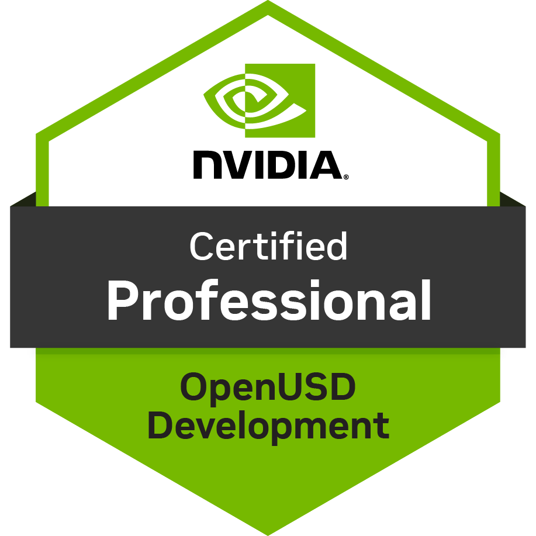

# 🤖 Physical AI Learning Journey — Sparsha Srinath

> Full stack developer with 2 years of experience transitioning into Physical AI and robotics simulation.
> Documenting my path from zero to NVIDIA Omniverse developer — honest notes, real friction points, and everything I build along the way.

  

  
---

## 🗺️ Timeline

| Day | Date   | Topics                                                                                                                        | Domains Covered                                                                                                                           |
| :-: | ------ | ----------------------------------------------------------------------------------------------------------------------------- | ----------------------------------------------------------------------------------------------------------------------------------------- |
|  1  | Jun 24 | USD Foundations                                                                                                               | Stage · Layer · Prim · Properties · Paths · File Formats · Metadata · Time Samples                                                        |
|  2  | Jun 25 | Composition Arcs Part 1                                                                                                       | Opinions · Value Resolution · LIVERPS · Sublayers · References · Payloads                                                                 |
|  3  | Jun 26 | Composition Arcs Part 2 · Advanced Composition · Schemas and Data Modeling                                                    | Variants · Inherits · Specializes · Edit Target · Session Layer · Flatten · IsA/API schemas · usdGenSchema · TfType · Model Kinds         |
|  4  | Jun 27 | Visualization · Pipeline and Data Exchange · Content Aggregation                                                              | Mesh · Primvars · UsdLux · Exporters · Importers · Hooks · Build Config · Instancing · PointInstancer                                     |
|  5  | Jun 28 | Debugging and Troubleshooting · Practice Test 1                                                                               | PrimStack · PropertyStack · TfDebug · MuteLayer · Composition Errors · **Score: 58%**                                                     |
|  6  | Jun 29 | Custom Schemas · Practice Test 2                                                                                              | usdGenSchema · TfType · Variant Fallbacks · Model Kinds · **Score: 62% (+4%)** · patched schema registration gaps                         |
|  7  | Jun 30 | Gap Review                                                                                                                    | Revisited TFType · visualisation exercises · patched Practice Test 2 gaps                                                                 |
|  8  | Jul 1  | Deep Dives                                                                                                                    | `stage.Flatten()` vs `UsdUtils.FlattenLayerStack()` · change notification · custom Model Kind · variant fallback sets · plugin deployment |
|  9  | Jul 2  | Gap Review                                                                                                                    | Hooks · prepend vs append arc ordering · explicit prim path vs defaultPrim                                                                |
| 10  | Jul 3  | Practice Test 3                                                                                                               | **Score: 67% (+5%)** · custom exporters · build configuration                                                                             |
| 11  | Jul 5  | Practice Test 4                                                                                                               | **Score: 77% (+10%)**                                                                                                                     |
| 12  | Jul 7  | An Introduction to Developing With NVIDIA Omniverse                                                                           | Kit app template · extensions · developer workflow                                                                                        |
| 13  | Jul 8  | Watched Hailey Ahn talk on Content Aggregation ([YouTube Live](https://www.youtube.com/live/LFCauWTNBM4?si=xcmupaXIEMtCtvug)) | Content aggregation concepts · practical context from expert session                                                                      |
| 14  | Jul 9  | OpenUSD Final Certification Exam                                                                                              | **Passed (NVIDIA-Certified Professional: OpenUSD Development)**                                                                           |
| 15  | Jul 11 | Synthetic Data Generation Kickoff                                                                                             | Omniverse Replicator planning · custom writer scaffold · run config draft · screenshot checklist                                          |
| 16  | Jul 12 | OmniGlam Project Started                                                                                                      | Project concept · brand design · shade collection · scene planning · FBX asset sourcing · USD conversion                                  |
| 17  | Jul 13 | Isaac Sim SDG Tutorials                                                                                       | Synthetic Data Recorder · Getting Started Scripts (Ex 1–5) · SDG Workflows (1+2) · Scene Based SDG · Object Based SDG · Data Augmentation · Randomization Snippets |
| 18  | Jul 14 | OmniGlam SDG Pipeline                                                                                               | 500 frame dataset · 7 shades · gold cases · 3-point lighting · backdrop switching · KITTI conversion · YOLOv8 training · web app (HTML) |

---

## ✅ Jun 26 — Brev cloud setup

**Goal:** Get Isaac Sim running without a local NVIDIA GPU.

**Status:** Complete · Jun 26, 2026

Isaac Sim requires an NVIDIA RTX GPU — running on Intel Iris Xe on Mac locally, so set up NVIDIA Brev cloud to spin up a GPU instance on demand. This is the recommended path for developers without local RTX hardware.

- Created NVIDIA Brev account
- Located Isaac Sim 6.0.0 with ROS2 Jazzy launchable (L40S GPU · $2.27/hr)
- Connected to noVNC desktop successfully
- Confirmed Isaac Sim and Kit are installed on the instance
- Full deployment and coursework begins TBD

---

## ✅ Jul 9 — OpenUSD Certification Passed

**Goal:** Understand the foundational language of the entire Physical AI stack.

**Status:** Passed · Jul 9, 2026

OpenUSD (Universal Scene Description) is the file format and framework that underpins Omniverse, Isaac Sim, and every robot and simulation asset in the Physical AI ecosystem. Originally built by Pixar for film pipelines, adopted by NVIDIA as the foundation of Omniverse.

**Key concepts:**

- Stage composition and prim hierarchy
- USD schemas and typed prims
- Referencing, layering, and composition arcs
- Python scripting with the USD API
- Why USD enables interoperability across the entire Physical AI stack

### 📊 Practice test progression

The cert requires a passing score of 80%. Here's the iterative journey to get there — each attempt identified weak areas and informed the next study session.

| Attempt             | Score      | Status | Key takeaway                                                          |
| ------------------- | ---------- | ------ | --------------------------------------------------------------------- |
| Practice Test 1     | 58%        | ❌     | Baseline — identified gaps in schema definition and composition arcs  |
| Practice Test 2     | 62%        | ❌     | +4% — improved on composition arcs, still weak on schema registration |
| Practice Test 3     | 67%        | ❌     | +5% — schema concepts improving, gaps in USD API and layering         |
| Practice Test 4     | 77%        | ❌     | +10% — strong improvement, approaching passing threshold              |
| **Final Cert Exam** | **Passed** | **✅** | NVIDIA-Certified Professional: OpenUSD Development                    |

> Every failed attempt was a study session in disguise — each score gap pointed directly to the next concept to revisit. 19 points gained across 4 attempts.

[📸 Test 1 →](./02-openUSD-cert/practice-tests/exam-1.png) | [📸 Test 2 →](./02-openUSD-cert/practice-tests/exam-2.png) | [📸 Test 3 →](./02-openUSD-cert/practice-tests/exam-3.png) | [📸 Test 4 →](./02-openUSD-cert/practice-tests/exam-4.png)

[🏅 Credly badge →](https://www.credly.com/badges/493a815e-02bd-44e3-91da-aea56614b27d/public_url) | [📄 Certificate PDF →](./02-openUSD-cert/assets/certification/openusd-ncp-certificate-2026-07-09.pdf) | [📝 Cert notes →](./02-openUSD-cert/README.md) | [💡 Key concepts →](./02-openUSD-cert/notes/)

---

## ✅ Jul 7 — An Introduction to Developing With NVIDIA Omniverse

**Goal:** Understand how Omniverse applications are built and extended.

Omniverse is NVIDIA's platform built on top of OpenUSD — the runtime, renderer, and app ecosystem that powers Isaac Sim and the broader Physical AI stack. This course covers building a Kit-based application from a template and customizing it via extensions.

**Key concepts:**

- How `.kit` files define and assemble Omniverse applications
- Adding and configuring extensions
- How Omniverse supports OpenUSD workflows under the hood
- The relationship: OpenUSD → Omniverse → Isaac Sim

[📝 Notes →](./03-omniverse-intro-course/README.md) | [📸 Screenshots →](./03-omniverse-intro-course/screenshots)

---

## 🔄 Jul 13 — Isaac Sim Synthetic Data Generation Tutorials

**Goal:** Learn the full Isaac Sim SDG pipeline before building an original project.

**Status:** In progress · Jul 13, 2026

Completed all available Isaac Sim Replicator SDG tutorials — building up from the GUI recorder to full Python pipelines with physics, multi-camera setups, and custom randomisers.

**Tutorials completed:**
- Synthetic Data Recorder — GUI-based recording, BasicWriter, custom writer with surface normals
- Getting Started Scripts — Examples 1–5 (BasicWriter, custom writer, randomisation, physics capture, batch performance)
- SDG Workflows — Workflow 1 (physics-based settling) + Workflow 2 (collision-checked placement)
- Scene Based SDG — full warehouse scene with forklift, pallet, 3 cameras, lights, material randomisation
- Object Based SDG — object-centric SDG for recognition across environments
- Data Augmentation — annotator and writer augmentation with Warp (GPU) and NumPy (CPU)
- Randomization Snippets — custom spatial distribution algorithms (on sphere, in sphere, between spheres)

[📝 Notes →](./05-synthetic-data-generation/notes.md)

---

## 🔄 Jul 12–14 — OmniGlam 

**Goal:** Build an end-to-end Physical AI pipeline for retail beauty robotics.

**Status:** In progress · Jul 12, 2026

OmniGlam is an original synthetic data generation project — a virtual lipstick brand with 7 tech-inspired shades, built to demonstrate how Physical AI can power fine-grained product recognition in retail.

**What's been built:**
- 7 lipstick shades with OmniPBR materials — bullet tips coloured per shade, gold metallic cases
- Full SDG pipeline — 500 annotated frames with lighting, camera, backdrop, and position randomisation
- KITTI format dataset — 397 train / 99 val frames
- YOLOv8 model training in progress
- OmniGlam web app — shade finder store built in HTML/CSS/JS

**The shades:** Deep Learning Red · Runtime Berry · Render Rose · Pixar Pink · Null Mauve · CuDiva · Softmax

[📁 Project folder →](./projects/omniglam-sdg/) | [📝 Project README →](./projects/omniglam-sdg/README.md)

---

## 🔗 Resources

| Resource                                          | Link                                                                                                                                                 |
| ------------------------------------------------- | ---------------------------------------------------------------------------------------------------------------------------------------------------- |
| NVIDIA OpenUSD Cert                               | [developer.nvidia.com/usd](https://developer.nvidia.com/usd)                                                                                         |
| OpenUSD Practice Tests                            | [Udemy course](https://www.udemy.com/course-dashboard-redirect/?course_id=7020603)                                                                   |
| Complete Guide to Passing the NVIDIA OpenUSD Cert | [Medium — @chaubenz](https://medium.com/@chaubenz/your-complete-guide-to-passing-the-nvidia-certified-professional-openusd-development-b129777b0ed6) |
| OpenUSD Live Session                              | [YouTube](https://www.youtube.com/live/85gC4Vja5Uo?si=9VvJhl4K_z_jJKyD)                                                                              |
| Isaac Sim Docs                                    | [docs.isaacsim.omniverse.nvidia.com](https://docs.isaacsim.omniverse.nvidia.com)                                                                     |
| Omniverse DLI Courses                             | [learn.nvidia.com](https://learn.nvidia.com)                                                                                                         |
| Isaac Sim on Brev                                 | [Brev cloud setup](https://docs.isaacsim.omniverse.nvidia.com/latest/installation/install_advanced_cloud_setup_brev.html)                            |
| NVIDIA Developer Discord                          | [discord.gg/nvidiaomniverse](http://discord.gg/nvidiaomniverse)                                                                                      |

---

  <i>Updated daily · Started Jun 24, 2026</i>

