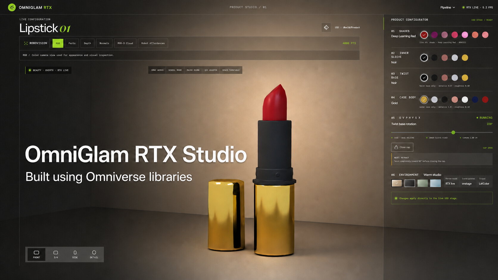

# OmniGlam RTX Studio

OmniGlam is a small, reproducible Omniverse project for exploring a lipstick
as both a configurable fashion product and a robot-perception object.

<p align="center">
  
</p>

It uses:

- **OpenUSD** for the product, studio, semantics, materials, and physics proxy;
- **ovrtx** for live GPU-rendered RGB, depth, normals, and semantic frames;
- **ovstage** for live scene and material updates;
- **ovphysx** for the twist mechanism, carrier motion, cap, and safety
  interlocks;
- **React + Vite** for the browser interface.

Isaac Sim and the Replicator API are not required.

## What works

- Seven lipstick shades and independent inner-sleeve, twist-base, case, and
  backdrop finishes
- Live RTX rendering from the referenced `lipstick.usd` asset
- Camera orbit, zoom, WASD movement, Q/E height, presets, and turntable mode
- PhysX-driven twist-to-height coupling with a fixed inner sleeve
- Cap rules: no twisting while closed, and no closing until fully retracted
- RoboVision RGB, semantic parts, depth, normals, RGB-D point cloud, and robot
  affordances
- Individual semantic-class visibility controls

## Project layout

```text
assets/
  lipstick.usd                  Original product asset
  omniglam_lipstick_scene.usda OpenUSD visual/studio layer
  lipstick_physics.usda        OpenUSD PhysX proxy
scripts/
  setup_brev.sh                Reproducible dependency installation
  start_brev.sh                Starts all three services in tmux
  start_gpu_bridge.sh          Starts ovrtx/ovstage
  start_physics_bridge.sh      Starts ovphysx
server/
  ovrtx_bridge.py              Render, scene-control, and RoboVision API
  ovphysx_bridge.py            Mechanism and cap API
src/
  main.jsx                     React application
  styles.css                   UI styling
```
> The lipstick FBX asset is not included due to licensing. Download a free lipstick model from [Sketchfab](https://sketchfab.com/search?q=lipstick&features=downloadable&price=free) (CC license) and place it in `assets/lipstick.fbx`.
## Requirements

- A Linux machine with a supported NVIDIA RTX GPU and working NVIDIA driver
- Python 3.10
- Node.js 20 or newer
- `tmux`
- About 5 GB of free disk space for NVIDIA Python packages and shader caches

The pinned runtime versions are:

```text
ovrtx   0.4.0.346409
ovstage 0.1.0.346039
ovphysx 0.5.9
numpy   2.2.6
Pillow  12.3.0
```

Rendering and physics intentionally use separate Python environments because
they load different native plugin sets.

## Reproduce on NVIDIA Brev

The project was tested with Brev's
`isaac-sim-5-1-0-with-ros-2-jazzy--extended` environment. Isaac Sim itself is
not used; the environment simply provides a suitable Ubuntu/NVIDIA starting
point.

NVIDIA documents Brev CLI installation and authentication in the
[Brev CLI getting-started guide](https://docs.nvidia.com/brev/latest/cli/getting-started).
The persistent Brev workspace is `/home/ubuntu/workspace`.

### 1. Connect to the instance

On your workstation:

```bash
brev login
brev refresh
brev ls
brev shell YOUR_INSTANCE_NAME
```

Verify the GPU inside the Brev shell:

```bash
nvidia-smi
```

### 2. Put the project in persistent storage

Clone from Git:

```bash
cd /home/ubuntu/workspace
git clone YOUR_REPOSITORY_URL omniglam-rtx-studio
cd omniglam-rtx-studio
```

Or copy the ZIP supplied with this project:

```bash
# Run this on your workstation.
brev copy omniglam-rtx-studio-github.zip \
  YOUR_INSTANCE_NAME:/home/ubuntu/workspace/

# Then run this inside the Brev shell.
cd /home/ubuntu/workspace
unzip omniglam-rtx-studio-github.zip
cd omniglam-rtx-studio
```

### 3. Install system tools

Check the existing versions first:

```bash
node --version
npm --version
tmux -V
```

If Node.js is older than 20:

```bash
curl -fsSL https://deb.nodesource.com/setup_22.x -o /tmp/nodesource_setup.sh
sudo -E bash /tmp/nodesource_setup.sh
sudo apt-get update
sudo apt-get install -y nodejs tmux unzip
```

If Node.js is already current, only install missing utilities:

```bash
sudo apt-get update
sudo apt-get install -y tmux unzip
```

### 4. Install the project

From the project root:

```bash
bash scripts/setup_brev.sh
```

The script:

1. verifies `nvidia-smi` and Node.js;
2. installs `uv` and Python 3.10;
3. creates `.venv` for ovrtx and `.venv-physx` for ovphysx;
4. installs the pinned NVIDIA/Python packages;
5. runs `npm ci` and a production build.

Package installation can take several minutes.

### 5. Start the application

```bash
npm run brev:start
```

This creates three persistent tmux sessions:

| Session            | Service          |   Port |
| ------------------ | ---------------- | -----: |
| `omniglam-ui`      | React/Vite       | `5177` |
| `omniglam-rtx`     | ovrtx render API | `8791` |
| `omniglam-physics` | ovphysx API      | `8792` |

Check them with:

```bash
tmux list-sessions
curl http://127.0.0.1:5177/
curl http://127.0.0.1:8791/api/status
curl http://127.0.0.1:8792/api/status
```

The first ovrtx launch may spend several minutes compiling RTX shaders.
It is ready when the status response includes `"state": "rendering"`,
`"error": null`, and `"live": true`.

Logs are stored in:

```text
.logs/ui.log
.logs/rtx.log
.logs/physics.log
```

Follow a log with:

```bash
tail -f .logs/rtx.log
```

### 6. Open the UI

From Firefox inside the Brev NoVNC desktop:

```text
http://127.0.0.1:5177/
```

To use a browser on your workstation, NVIDIA recommends Brev port forwarding:

```bash
brev port-forward YOUR_INSTANCE_NAME --port 6177:5177
```

Then open:

```text
http://127.0.0.1:6177/
```

The mapping is `local:remote`, so local port `6177` forwards to Vite port
`5177` on Brev. See NVIDIA's
[Brev connectivity documentation](https://docs.nvidia.com/brev/cli/connectivity)
for other tunnel options.

### 7. Stop or restart

Stop the services:

```bash
tmux kill-session -t omniglam-ui
tmux kill-session -t omniglam-rtx
tmux kill-session -t omniglam-physics
```

Restart all missing sessions:

```bash
npm run brev:start
```

Files under `/home/ubuntu/workspace` survive an instance stop, but are deleted
if the instance itself is deleted.

## Controls

- Drag: orbit camera
- Wheel/trackpad: zoom
- `W` / `A` / `S` / `D`: move camera target
- `Q` / `E`: lower or raise camera target
- Space: toggle the lipstick turntable
- Front / 3/4 / Side / Detail: camera presets
- Twist slider: rotate the case body and twist base and move the carrier
- Open/Close cap: perform the allowed cap action for the current mechanism

## Run locally

The same setup works on a supported Ubuntu workstation:

```bash
bash scripts/setup_brev.sh
npm run brev:start
```

Open `http://127.0.0.1:5177/`.

For frontend-only development, run `npm ci && npm run dev`. The app shows its
fallback product view until the RTX and PhysX bridges are available.

## Troubleshooting

### The UI opens but is not live

```bash
curl http://127.0.0.1:8791/api/status
tail -n 100 .logs/rtx.log
nvidia-smi
```

Wait if the renderer is in `loading-scene` or `warming-up` with no error.

### `localhost:5177` is unavailable from the workstation

`127.0.0.1` inside Brev refers to the Brev instance, not your workstation.
Start `brev port-forward ... --port 6177:5177` and use
`http://127.0.0.1:6177/` locally.

### A service is already running

`npm run brev:start` leaves healthy tmux sessions untouched. To replace one:

```bash
tmux kill-session -t omniglam-rtx
npm run brev:start
```

### Check exact process ports

```bash
ss -ltnp | grep -E ':(5177|8791|8792)'
```
