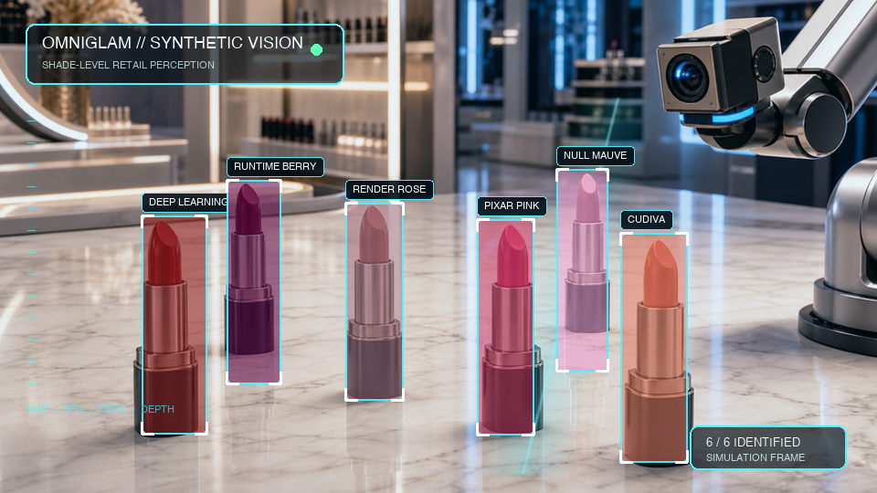
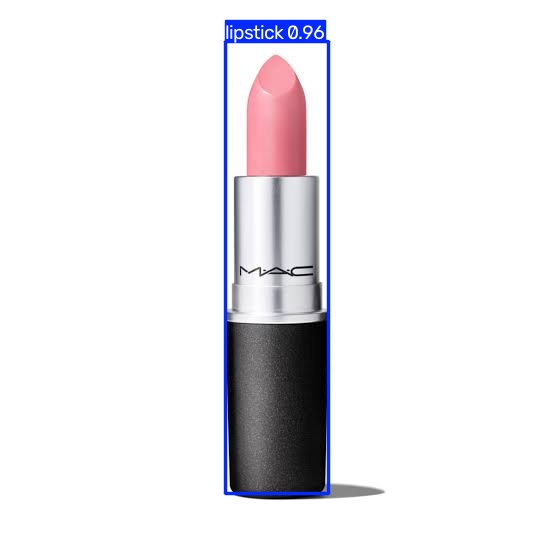
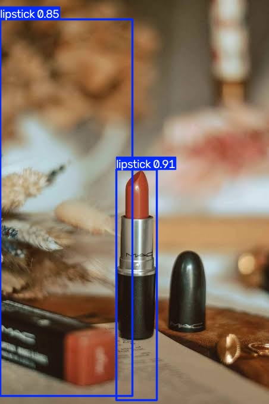
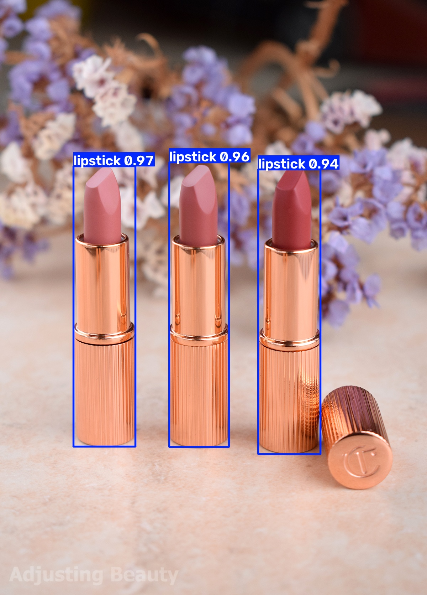
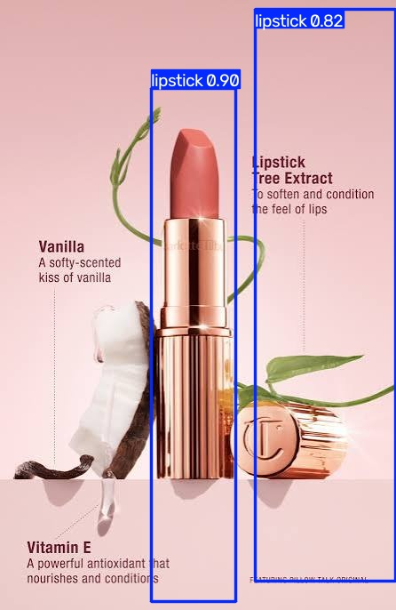
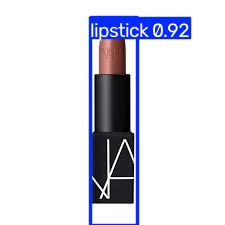
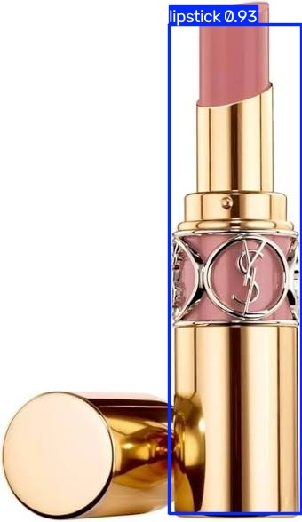
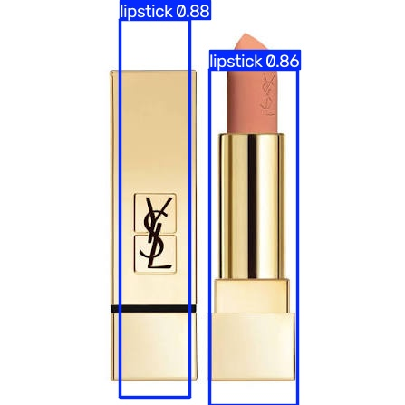
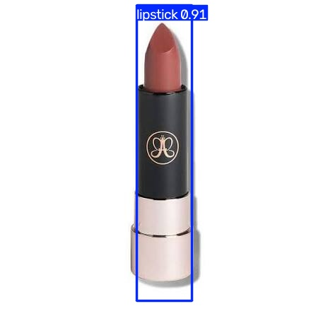
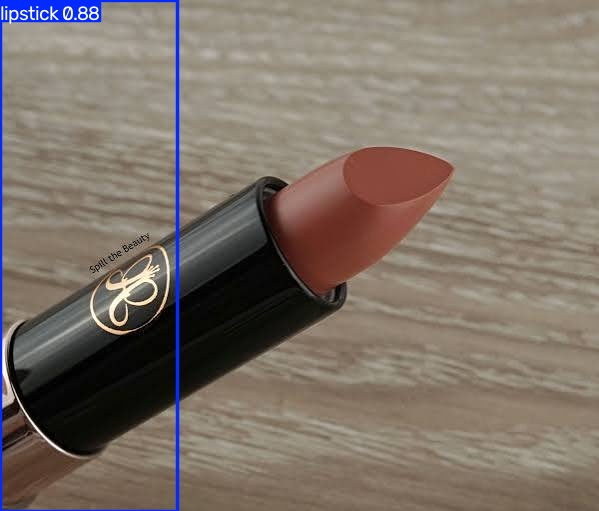

# 💄 OmniGlam — Synthetic Data Generation for Retail Beauty Robotics

<p align="center">
  <a href="./assets/omniglam-vision.gif">
    
  </a>
  <br>
  <sub>▶ Click the preview to view the animation</sub>

  *The vision: a robot arm that can scan and identify each OmniGlam lipstick shade by name. This project builds the synthetic data pipeline that makes that possible, generating the training data a robot would need to get there.*

</p>

**Brand:** OmniGlam  
**Built with:** NVIDIA Isaac Sim 5.1.0 · Omniverse Replicator · OpenUSD · Brev Cloud · L40S GPU  
**By:** Sparsha Srinath

<p align="center">
  <a href="https://www.linkedin.com/posts/sparsha-srinath_physicalai-nvidia-isaacsim-ugcPost-7483433454479626240-QmWl/?utm_source=share&utm_medium=member_desktop&rcm=ACoAADVOQsgBcMXTitzsJl-fRL6ThL8hOGwpQ_c">
    
  </a>
</p>

---

## 🎯 What is this project?

OmniGlam is a synthetic data generation pipeline built in NVIDIA Isaac Sim to demonstrate how photorealistic training data can be generated automatically for retail product recognition, without collecting a single real photo.

Using Isaac Sim's Replicator API, a single 3D scene generates hundreds of perfectly annotated training frames by randomising lighting, surfaces, object appearances, and camera angles. Every frame is labelled automatically. Zero manual photography. Zero manual annotation.

The use case: given a photo of any lipstick, from any brand, with any casing colour, against any background, detect the tube and identify which OmniGlam shade the bullet tip most closely matches. The model is trained to detect and localise the lipstick tube. Shade identification is handled by colour extraction on the detected bullet tip region, matched to the closest OmniGlam shade by Euclidean RGB distance.

This clean separation of detection and classification is intentional. It reflects how production robotics systems are actually built.

---

## 🏷️ OmniGlam Shade Collection

| Shade | Colour | Hex | RGB |
|---|---|---|---|
| Deep Learning Red | deep red | `#962121` | (0.59, 0.13, 0.13) |
| Runtime Berry | dark berry | `#64094b` | (0.39, 0.04, 0.29) |
| Render Rose | muted rose | `#a4707f` | (0.64, 0.44, 0.50) |
| Pixar Pink | vibrant pink | `#cd3a64` | (0.80, 0.23, 0.39) |
| Null Mauve | soft mauve | `#f4a3d8` | (0.96, 0.64, 0.85) |
| CuDiva | warm coral | `#e1765e` | (0.88, 0.46, 0.37) |
| Softmax | soft blush | `#ed9297` | (0.93, 0.57, 0.59) |

---

## 🏗️ Project Status

| Step | Status | Notes |
|---|---|---|
| Shade names and colours defined | ✅ | 7 tech-inspired shades |
| Lipstick asset sourced + converted to USD | ✅ | FBX from Sketchfab converted to USD via Omniverse asset converter |
| Scene built in Isaac Sim | ✅ | Floor + 3 walls + 3-point lighting (KeyLight · FillLight · RimLight) |
| 7 shade instances created | ✅ | OmniPBR materials per shade · 7 case colour variants · caps hidden |
| Semantic labels added | ✅ | Single class lipstick label via rep.functional.modify.semantics |
| Camera + render product set up | ✅ | 5 angle presets + close-up single tube · focal_length=18.0 |
| Randomisers configured | ✅ | Lighting · positions · camera · 7 backgrounds · 7 case colours · 21 bullet tip colours |
| SDG pipeline v1 — omniglam_sdg.py | ✅ | 500 frames · 7 shade classes · gold cases · white/black backdrop · BasicWriter |
| SDG pipeline v2 — omniglam_sdg.py (updated) | ✅ | 7 case colour variants · 7 backgrounds with walls · 6 lighting presets |
| SDG pipeline v3 — omniglam_v3.py | ✅ | Single class lipstick · 21 randomised bullet tip colours · Isaac Lab ready |
| Dataset converted to KITTI format | ✅ | 80/20 train/val split · convert_to_kitti.py |
| YOLOv8 v3 model training | ✅ | mAP50 98.49% · mAP50-95 97.34% · Precision 100% · Recall 97.6% · [📄 metrics](#-model-metrics--v3)|
| Real photo validation — 10 unseen images | ✅ | 9/10 detected across MAC · YSL · NARS · Charlotte Tilbury · Anastasia Beverly Hills |
| Two-stage inference pipeline | ✅ | YOLOv8 detection + RGB colour matching for shade identification |
| Web app — OmniGlam shade finder | ✅ | HTML + CSS + JS + FastAPI |
| LinkedIn demo video published | ✅ | [▶ Watch demo](https://www.linkedin.com/posts/sparsha-srinath_physicalai-nvidia-isaacsim-ugcPost-7483433454479626240-QmWl/?utm_source=share&utm_medium=member_desktop&rcm=ACoAADVOQsgBcMXTitzsJl-fRL6ThL8hOGwpQ_c) |

---

## 📈 Model Metrics — v3

| Metric | Score |
|---|---|
| Precision | 100% |
| Recall | 97.6% |
| mAP50 | 98.49% |
| mAP50-95 | 97.34% |
| Training epochs | 50 |
| Training time | 12.3 hours |
| Validation images | 200 |
| Validation instances | 467 |

---

## 🔧 Tech Stack

```
OpenUSD            scene description and asset format
NVIDIA Omniverse   platform and rendering engine
Isaac Sim 6.0.0    simulation environment
Replicator API     randomisation and data capture
BasicWriter        annotated dataset output (RGB + bbox + semantic seg)
OmniPBR            physically based materials per shade
YOLOv8             object detection model training (ultralytics)
FastAPI            inference API backend
HTML · CSS · JS    web app frontend
Brev Cloud         L40S GPU cloud instance
```

---

## 🎨 Scene Design

**Environment:**
- Floor and 3 walls (box geometry) with colour matched per background preset
- 3-point lighting setup: KeyLight (warm), FillLight (cool), RimLight (white) + ambient distant light
- 7 floor/wall background variants: white studio, black dramatic, wood, marble, warm wall, textured wall, pink

**Two row arrangement:**
- Back row: Deep Learning Red · Render Rose · Null Mauve · Softmax
- Front row: Runtime Berry · Pixar Pink · CuDiva

**What gets randomised every frame:**
- Tube visibility (1 to 4 tubes per frame, every 8th frame = single tube close-up)
- Tube positions (slight scatter within row) and rotation (±8° tilt)
- Camera angle (5 presets: front angled, side left/right, close-up + random variation ±0.5)
- Lighting intensity and colour temperature (6 presets from warm golden to dim fluorescent)
- Background floor and wall colour (7 variants, weighted towards white)
- Case colour (7 variants: gold, silver, black matte, rose gold, white, navy, red)
- Base/bottom colour matched to case variant
- Bullet tip colour (21 colours covering reds, pinks, berries, mauves, nudes, corals, blushes) — v3 only

---

## 📊 Pipeline Versions

| Version | Script | Frames | Classes | Key additions |
|---|---|---|---|---|
| v1 | `omniglam_sdg.py` | 500 | 7 shade names | Baseline pipeline |
| v2 | `omniglam_sdg.py` (updated) | 500 | 7 shade names | Case colour variants · diverse backgrounds · walls |
| v3 | `omniglam_v3.py` | 500 | lipstick (single) | 21 bullet tip colours · Isaac Lab ready |

**Why single class in v3:**
The neural network is trained purely for detection and localisation. Shade identification is handled separately by RGB colour matching on the detected bullet tip region. This separation makes the detector more robust and prepares the pipeline for Isaac Lab manipulation training, where the robot needs to detect any lipstick tube regardless of shade.

---

## 📊 Dataset Output

For each captured frame the pipeline generates:

| File | Contents | Purpose |
|---|---|---|
| `rgb_*.png` | Photorealistic scene (1024x1024) | Training image |
| `semantic_segmentation_*.png` | Colour-coded shade map | Pixel-level identification |
| `bounding_box_2d_tight_*.npy` | Bounding box coordinates | Object detection training |
| `bounding_box_2d_tight_labels_*.json` | Class labels | Annotation metadata |

**Dataset statistics (v3):**
- Total frames: 500
- Train: 400 frames · Val: 100 frames
- Single class: lipstick
- 21 bullet tip colour variants
- 7 case colour variants
- 7 background variants

---

## 🧪 Real Photo Validation — 10 Unseen Images

The v3 model was tested on 10 real lipstick photos from 5 brands never seen during training. All images were sourced from the internet — no real photos were used in training.

**Result: 9/10 detected across 5 brands, never seen in training.**

[📁 View full inference results →](https://github.com/sparsha-2011/physical-ai-learning-journey/tree/main/projects/omniglam-sdg/inference_results)

### MAC
| mac_1.jpg | mac_2.jpg |
|---|---|
|  |  |
| ✅ Detected | ⚠️ Bounding box on the left — false positive |

### Charlotte Tilbury
| charlotte_tilbury_1.jpg | charlotte_tilbury_2.jpg |
|---|---|
|  |  |
| ✅ Detected | ⚠️ Bounding box on cap — false positive |

### NARS
| nars_1.webp | nars_2.jpg |
|---|---|
|  |  |
| ✅ Detected | ✅ Detected |

### YSL
| ysl_1.jpg | ysl_2.jpg |
|---|---|
|  |  |
|  ✅ Detected| ✅ Detected — closed tube, shows generalisation |

### Anastasia Beverly Hills
| anastasia_beverly_hills_1.jpg | anastasia_beverly_hills_2.jpg |
|---|---|
|  |  |
|✅ Detected | ❌ Diagonal tube — missed |

**Notable observations:**

The YSL closed lipstick detection shows the model generalised beyond its training distribution. Training data only contained open tubes but the model correctly identified a closed tube as a lipstick — demonstrating it learned the overall form factor, not just the open tube appearance.

---

## ⚠️ Known Limitations

**Diagonal tube detection:**
The bounding box annotator in Isaac Sim generates axis-aligned boxes. When a lipstick is significantly tilted in the real world, the axis-aligned bounding box does not align with the tube and detection may fail. The Anastasia Beverly Hills diagonal image demonstrates this. Pose-aware detection or oriented bounding boxes would fix this in a future version.

**Horizontal cap false positive:**
A lipstick cap placed horizontally on a surface has a similar form factor to a tube from certain angles. The model has not seen caps as a separate negative class so it classifies them as lipsticks. Adding cap-only images as negative examples in the training data would address this.

**Bullet tip crop assumes upright tube:**
The inference pipeline crops the top 30% of the bounding box to extract the bullet tip region for colour matching. If the tube is significantly tilted the bullet tip may not be in the top 30% of the box, reducing shade matching accuracy.

---


Detection and shade classification are intentionally separated into two stages:

**Stage 1 — YOLOv8 detection (neural network)**
Trained on synthetic data to detect and localise lipstick tubes in any image, regardless of casing colour or background. Returns a bounding box.

**Stage 2 — Colour matching (RGB distance)**
Crops the top 30% of the bounding box (the bullet tip region). Extracts the average pixel colour. Finds the closest OmniGlam shade by Euclidean distance in RGB space.

This architecture is robust to real-world variation. The neural network handles the spatial detection problem. Colour mathematics handles the shade identification problem. Each stage does what it does best.

---

## 💼 Why this matters

**For retail robotics:**
Robots operating in retail environments need to recognise specific product variants at scale, not just product categories. Collecting real-world training data for this is slow, expensive, and hard to scale. This project demonstrates that synthetic data generation in Isaac Sim can replace that entire data collection process.

**Research backing:**
- [Synthetica (NVIDIA, 2024)](https://arxiv.org/abs/2410.21153) — photorealistic synthetic data closes the sim-to-real gap
- [FLORA (2025)](https://arxiv.org/abs/2508.21712) — 500 quality synthetic images can outperform 5,000 poorly generated ones

---

## 🚀 How to run

### Prerequisites
- NVIDIA Brev account: [brev.nvidia.com](https://brev.nvidia.com)
- Isaac Sim 5.1.0 launchable deployed on Brev (L40S GPU)
- noVNC + VS Code browser open

### Step 1 — Deploy Brev instance
1. Go to `brev.nvidia.com`
2. Deploy **Isaac Sim 5.1.0 with ROS2 Jazzy** launchable
3. Connect via noVNC and VS Code browser

### Step 2 — Clone the repo
```bash
cd ~/Documents
git clone https://github.com/sparsha-2011/physical-ai-learning-journey.git
cd physical-ai-learning-journey/projects/omniglam-sdg
```

### Step 3 — Add the lipstick asset
The lipstick FBX asset is not included due to licensing. Download a free lipstick model from [Sketchfab](https://sketchfab.com/search?q=lipstick&features=downloadable&price=free) (CC license) and place it in `assets/lipstick.fbx`.

Convert FBX to USD in Isaac Sim Script Editor:
```python
import asyncio
import omni.kit.asset_converter as converter

async def convert():
    task = converter.get_instance().create_converter_task(
        "/path/to/assets/lipstick.fbx",
        "/path/to/assets/lipstick.usd"
    )
    await task.wait_until_finished()

asyncio.ensure_future(convert())
```

### Step 4 — Run the SDG pipeline
Open Isaac Sim Script Editor (Window > Script Editor) and run `omniglam_v3.py` for the latest pipeline.

### Step 5 — Push to GitHub before stopping Brev
```bash
cd ~/Documents/physical-ai-learning-journey
git add .
git commit -m "OmniGlam SDG output - session $(date +%Y-%m-%d)"
git push
```

> Always push to GitHub before stopping your Brev instance — storage does not persist between sessions.

---

## 📖 Learning context

This project is part of my Physical AI learning journey. I am a full stack developer pivoting into Physical AI and robotics simulation.

**Prerequisites completed before building this:**
- NVIDIA OpenUSD Certification ✅
- Intro to NVIDIA Omniverse course ✅
- Isaac Sim SDG tutorials (Recorder · Getting Started · Workflows · Scene Based · Object Based · Augmentation) ✅

**Full learning journey:** [physical-ai-learning-journey](https://github.com/sparsha-2011/physical-ai-learning-journey)

---

## 🔗 Resources

| Resource | Link |
|---|---|
| NVIDIA Isaac Sim | [docs.isaacsim.omniverse.nvidia.com](https://docs.isaacsim.omniverse.nvidia.com) |
| Omniverse Replicator | [docs.omniverse.nvidia.com/extensions/latest/ext_replicator](https://docs.omniverse.nvidia.com/extensions/latest/ext_replicator.html) |
| Isaac Sim on Brev | [Brev cloud setup](https://docs.isaacsim.omniverse.nvidia.com/latest/installation/install_advanced_cloud_setup_brev.html) |
| OpenUSD | [openusd.org](https://openusd.org) |
| Synthetica paper | [arxiv.org/abs/2410.21153](https://arxiv.org/abs/2410.21153) |
| FLORA paper | [arxiv.org/abs/2508.21712](https://arxiv.org/abs/2508.21712) |
| YOLOv8 | [docs.ultralytics.com](https://docs.ultralytics.com) |

---

*Updated as the project progresses · Built by Sparsha Srinath*
